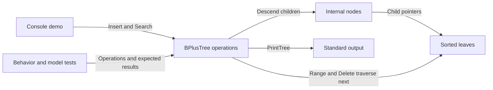
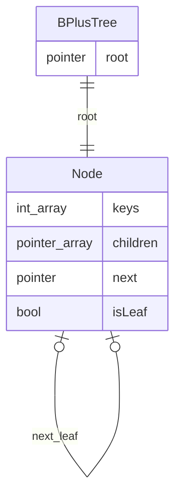

# Architecture

## Overview

One Go package combines a console demo and an in-memory data structure. Internal nodes hold routing separators; leaves hold all multiset occurrences and form a forward chain ([node fields](../../lib.go#L9), [split logic](../../lib.go#L91)). There is no server or storage adapter between callers and the tree.

## Components

| Component | Responsibility | Lives in | Talks to |
| --- | --- | --- | --- |
| Demo | Execute a fixed insertion/search scenario and display it. | [Root folder](../../), [main.go:5](../../main.go#L5) | Tree and stdout |
| Tree algorithms | Construct, split, insert, search, scan, rebuild, and print. | [Root folder](../../), [lib.go:24](../../lib.go#L24) | Nodes and stdout |
| Node representation | Keep sorted keys, children, leaf status, and next-leaf links. | [Root folder](../../), [lib.go:9](../../lib.go#L9) | Other nodes |
| Verification | Compare behavior with expected membership and a sorted multiset. | [Root folder](../../), [lib_test.go:9](../../lib_test.go#L9), [model_test.go:10](../../model_test.go#L10) | Tree and Go test runner |

See the [file inventory](03-structure.md#root) for ownership within this single folder.

## Boundaries and contracts

- Construct with [NewBPlusTree](../../lib.go#L24): operations assume a non-nil root. Node fields and the root are unexported, although the types and operation methods are exported within a `main` package.
- [Insert](../../lib.go#L34) keeps duplicate `int` keys; [Search](../../lib.go#L130) reports membership, not counts. Equality follows the right child at internal separators.
- [Range](../../lib.go#L172) returns a fresh, sorted slice with inclusive endpoints, including duplicates; inverted bounds return a non-nil empty slice.
- [Delete](../../lib.go#L197) removes the first matching leaf occurrence and returns true, or returns false without changing the tree. [PrintTree](../../lib.go#L152) writes directly to stdout.
- Calls require external synchronization if shared across goroutines: the [tree state](../../lib.go#L20) and [mutations](../../lib.go#L34) have no locking. The documented [v1 contract](../../README.md#L19) is single-threaded.

## Data model

The self-relations describe pointer structure, not database tables. `children` belongs to internal nodes; `next` connects leaves only ([fields](../../lib.go#L9)). Internal separators may equal leaf values and do not represent additional multiset occurrences ([leaf split](../../lib.go#L100)).

## State and persistence

The root and reachable nodes are the entire in-memory state ([BPlusTree](../../lib.go#L20)); there is no serialization or disk I/O in the implementation. A successful deletion replaces the root and reinserts surviving values ([lib.go:216](../../lib.go#L216)). Process exit loses the data, consistent with [README:19](../../README.md#L19).

## Deployment

`go run .` starts one local process executing the [fixed demo](../../main.go#L5); `go build .` builds that command from the [module](../../go.mod#L1). There is no repository CI, container, or service deployment configuration in the [tracked inventory](03-structure.md#what-lives-where).

## Failure and scale

- Missing searches/deletes return false; inverted ranges return an empty slice ([Search](../../lib.go#L148), [Delete](../../lib.go#L213), [Range](../../lib.go#L174)). A zero-value tree has a nil root and normal operations can panic; use the constructor.
- `ORDER = 3` caps keys per node, making splits frequent ([lib.go:7](../../lib.go#L7)). Descent-based search/insertion have logarithmic height behavior; scans start at the left edge and are O(n) in the worst case ([Range](../../lib.go#L177)).
- Successful deletion is O(n log n) and allocates an O(n) temporary key slice; even a missing delete walks and copies all keys before returning ([Delete](../../lib.go#L195)). No sharding, durability, or concurrent-operation mechanism is implemented.
