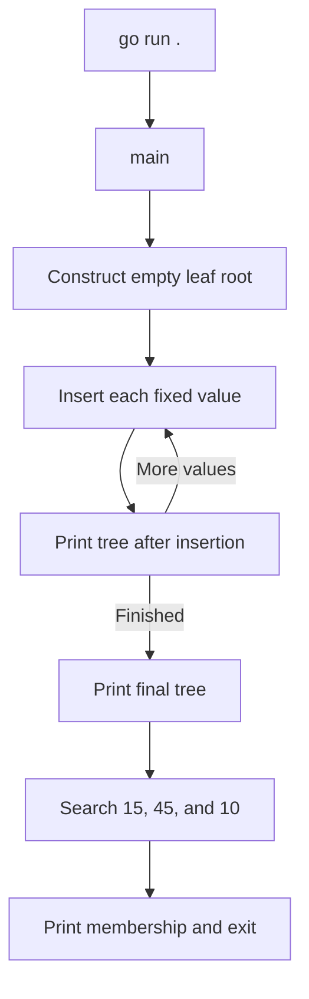
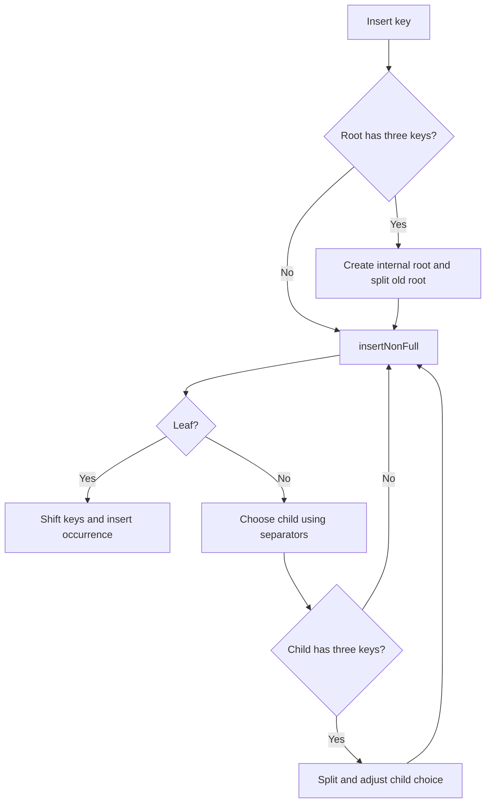
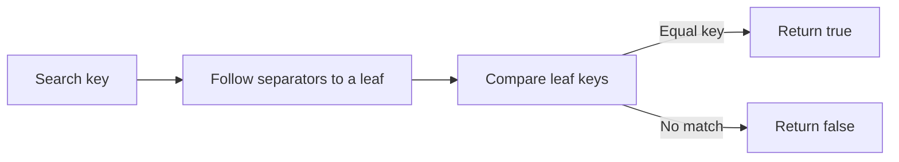
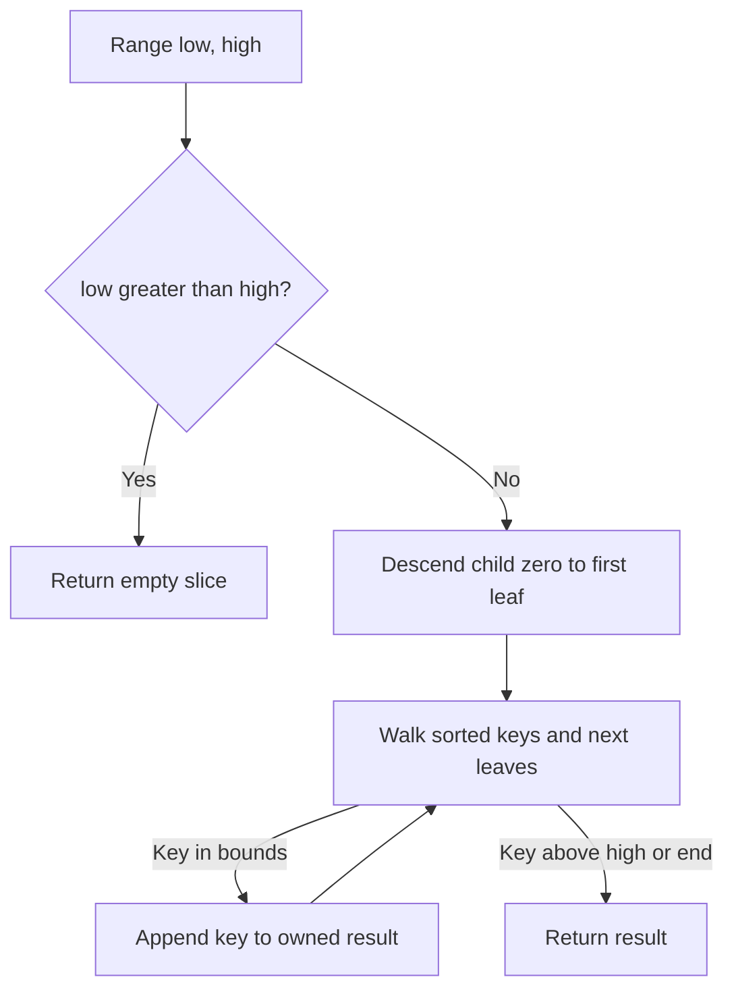
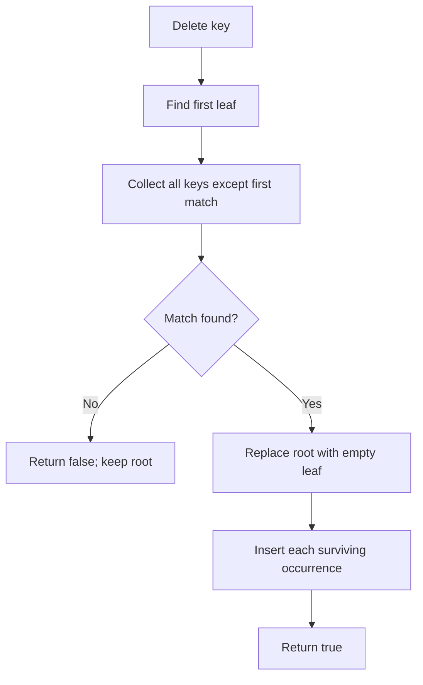
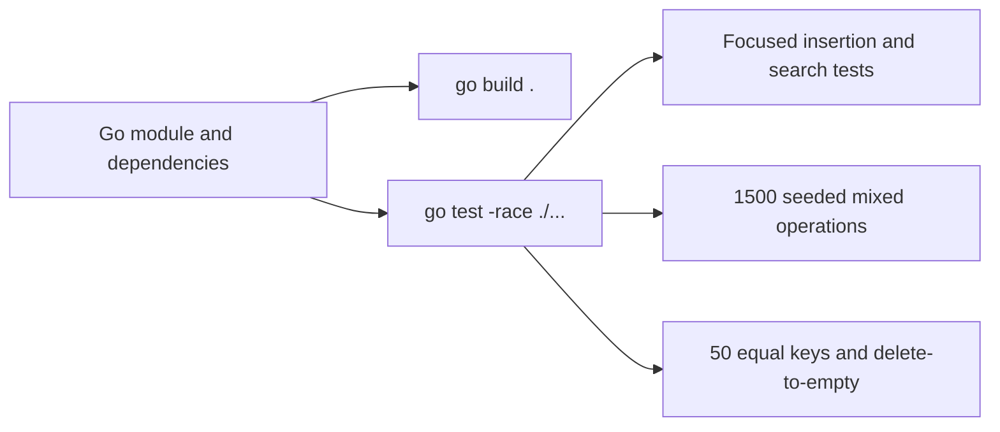

# Flow

## Startup and demo

1. Go enters [main.go:5](../../main.go#L5), which calls the constructor; there is no configuration/bootstrap phase beyond creating an empty leaf root at [lib.go:24](../../lib.go#L24). [Owner](03-structure.md#root).
2. The loop inserts nine hardcoded integers and prints after each insertion ([main.go:8](../../main.go#L8)). [Owner](03-structure.md#root).
3. Printing recursively visits children and labels node depth and leaf status ([lib.go:152](../../lib.go#L152)); the demo prints the final tree again ([main.go:16](../../main.go#L16)). [Owner](03-structure.md#root).
4. Three lookups produce found/not-found console messages and then the process returns ([main.go:19](../../main.go#L19)). The demo does not invoke Range or Delete. [Owner](03-structure.md#root).

## Insertion and splitting

1. [Insert:34](../../lib.go#L34) splits a full root before calling `insertNonFull`, allowing height to grow at the root. [Owner](03-structure.md#root).
2. At an internal node, [insertNonFull:63](../../lib.go#L63) routes equality right, splits a full child, adjusts the chosen child against the new separator, then recurses. [Owner](03-structure.md#root).
3. [splitChild:81](../../lib.go#L81) divides leaves at the midpoint, links the new leaf into the forward chain, and copies its minimum into the parent. For internal nodes it promotes the middle separator, divides children, and then inserts the new sibling into the parent. [Owner](03-structure.md#root).
4. At a leaf, [lib.go:50](../../lib.go#L50) locates the first key greater than or equal to the new value, shifts the suffix, and inserts without deduplication. The call returns after mutation. [Owner](03-structure.md#root).

## Membership lookup

1. [Search:130](../../lib.go#L130) starts at the root and follows the child after every separator less than or equal to the query until it reaches a leaf. [Owner](03-structure.md#root).
2. [lib.go:143](../../lib.go#L143) checks that leaf's keys for equality, returning true on a match and false otherwise. It does not need to count duplicates or traverse leaf links. [Owner](03-structure.md#root).

## Inclusive range scan

1. [Range:172](../../lib.go#L172) allocates an empty result and immediately returns it for inverted bounds. [Owner](03-structure.md#root).
2. [lib.go:177](../../lib.go#L177) descends the leftmost path, then walks the `next` chain so duplicate values on both sides of a separator are retained. [Owner](03-structure.md#root).
3. [lib.go:183](../../lib.go#L183) appends keys at least `low`, stops at the first key above `high`, and otherwise returns after the last leaf. The result does not expose node slices. [Owner](03-structure.md#root).

## Deletion by rebuilding

1. [Delete:197](../../lib.go#L197) descends to the first leaf, walks all leaves, and copies every occurrence except the first matching value into a temporary slice. [Owner](03-structure.md#root).
2. [lib.go:213](../../lib.go#L213) returns false without a root change if the value is missing. [Owner](03-structure.md#root).
3. [lib.go:216](../../lib.go#L216) resets to a new empty leaf and reinserts survivors through the normal insertion path; removing the final occurrence leaves a constructor-shaped empty tree. It then returns true. [Owner](03-structure.md#root).

## Build and verification

1. Go resolves the module and declared Go/test dependencies from [go.mod:1](../../go.mod#L1); build compiles the [main entry point](../../main.go#L5). [Owner](03-structure.md#root).
2. The test runner executes the focused [lib_test.go:9](../../lib_test.go#L9) scenarios and a seed-42 model loop of 1,500 insert/delete operations, checking a full range and every key from -25 through 24 after each update ([model_test.go:10](../../model_test.go#L10)). [Owner](03-structure.md#root).
3. [TestRangeDuplicates:41](../../model_test.go#L41) checks 50 equal keys, deletion to empty, missing deletion, and inverted bounds. The race-enabled command is documented in [README:15](../../README.md#L15); these tests do not run concurrent tree access. [Owner](03-structure.md#root).
